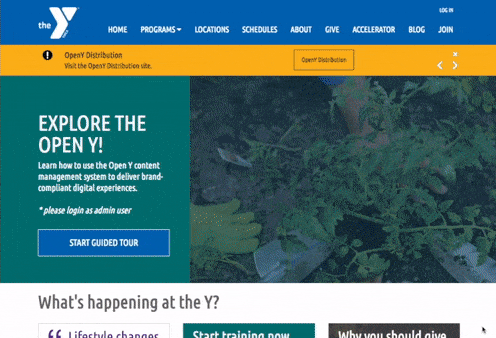

<p align="center">
 <!-- Will replace with new Open Y logo soon. <a href="https://openy.org">
    
  </a> -->
</p>

<h3 align="center">
  Open Y on Drupal 9
</h3>
<p align="center">
  https://openy.org
</p>
<p align="center">
  An open source platform for YMCAs, by YMCAs built on <a href="https://drupal.org">Drupal</a>, ReactJS, Vue.js and others.
</p>

<p align="center">
  <a href="https://packagist.org/packages/ymcatwincities/openy"></a>
  <a href="https://packagist.org/packages/ymcatwincities/openy"></a>
</p>

***

The Open Y platform is a content management system that uses Drupal 9 functionality and useful modules from YMCAs and digital partners. It’s easy and free to use — everyone is welcome to implement Open Y and run Open Y projects.

# Demo
You can always evaluate distribution by visiting demo website - http://sandboxes-d9.openy.org. To get admin credentials to the sandbox - please [visit page for details](https://community.openymca.org/t/how-can-i-try-or-get-a-demo-of-open-y/318).



*\* Open Y version 1.3.*

# Installation

### Prerequisites

- Installed [Composer](https://getcomposer.org/download/)

### Installation of Open Y
We are using [composer](https://getcomposer.org/) for initiating new project tree.

Development version of Open Y on Drupal 9
```sh
composer create-project ymcatwincities/openy-project:dev-9.2.x-development OPENY --no-interaction
```

Stable version of Open Y on Drupal 9
```sh
composer create-project ymcatwincities/openy-project OPENY --no-interaction
```

In order to properly install Open Y Distribution, we have separate composer project - [openy-project](https://github.com/ymcatwincities/openy-project). Please read detailed installation instructions [here](https://github.com/ymcatwincities/openy-project).

# Development
For development environment please read documentation [openy-project](https://github.com/ymcatwincities/openy-project#development-environment).

Other development information you can find at [docs/Development](https://docs.openy.org/docs/development/).


# Documentation
- [Wiki](https://docs.openy.org/docs/wiki/)
- [Documentation](https://docs.openy.org/docs/)
- [Installation instructions](https://github.com/ymcatwincities/openy-project#installation)
- [Content structure](https://docs.openy.org/docs/content-structure/)
- [Technical documentation](https://docs.openy.org/docs/development/)
- [Terms of Use](https://docs.openy.org/docs/wiki/open-y-terms-of-use/)
- [Participation Agreement](https://docs.openy.org/docs/wiki/open-y-participant-agreement/)
