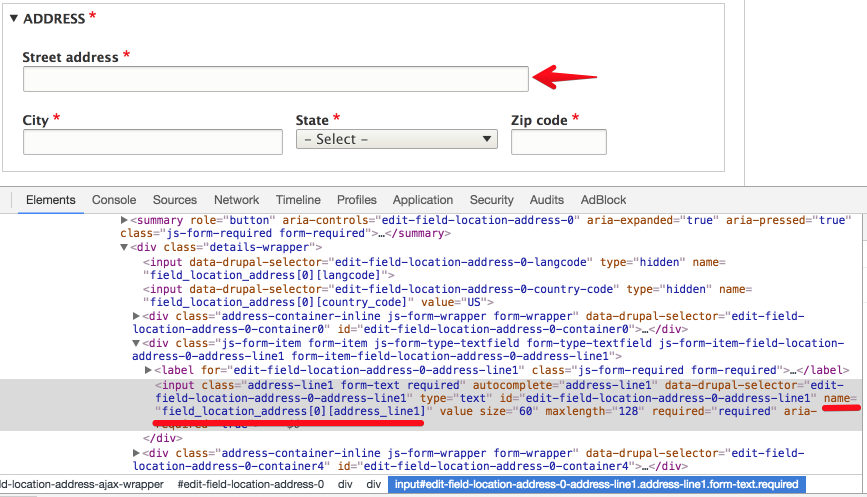

# Running Tests
These instructions explain how you can run tests.


## Behat
### Requirements
- Ansible 1.9.4+ http://docs.ansible.com/ansible/intro_installation.html
- Docker https://docs.docker.com/engine/installation/

### Run full test suite
1. Execute command

    ```
    $ cd profiles/contrib/openy
    $ sh runtests.sh
    ```
2. Open http://site.com/profiles/contrib/openy/build/reports/behat in browser.

### Run selenium container + Behat tests in usual way
In order to run only selenium container + behat in usual way:

```
$ cd profiles/contrib/openy
$ sh runtests.sh --tags run_selenium
$ bin/behat
```
    
### Stop selenium container
In order to stop  selenium container:

```
$ cd profiles/contrib/openy
$ sh runtests.sh --tags stop_selenium
```

If necessary, edit behat.local.yml to match your environment.

### Visual debugging - [Video](https://youtu.be/qYtpiA1ClVc)

When you develop JS tests, it's important to see what's going on the Selenium screen. You can easily see this during development.

1. Install [https://www.realvnc.com/download/viewer](https://www.realvnc.com/download/viewer)
2. Run selenium using command

```
$ cd profiles/contrib/openy
$ sh runtests.sh --tags run_selenium
```

3. Open installed VNC Viewer and connect to the server with IP `192.168.56.132:5901`
* Password = secret

4. Run tests and you should see everything that is performed by behat tests in VNC client
```
$ bin/behat
```

[](https://youtu.be/RSsQLVVhldc)


### Custom Behat functionality

- Create entities in table forms, with key to use in reference and reference entities by key.
  - KEY is optional, and **must be all CAPS**.
  - Taxonomy
    ```
    Given I create "taxonomy_term" of type "color" with key for reference:
      | KEY  | name  | field_color |
      | Blue | Blue  | 0000FF      |
      | Red  | Red   | FF0000      |
    ```
  - Paragraphs
    ```
    Given I create "paragraph" of type "small_banner" with key for reference:
      | KEY     | field_prgf_headline | field_prgf_color |
      | banner1 | Headline 1          | Blue             |
      | banner2 | Headline 2          | Red              |
    ```
  - Media entities
    ```
    Given I create "media" of type "image" with key for reference:
      | KEY       | name            | file         |
      | gallery_1 | Gallery image 1 | gallery.png  |
      | gallery_2 | Gallery image 2 | gallery2.png |
      | gallery_3 | Gallery image 3 | gallery3.png |
    ```
- Create nodes in table forms, with key to use in reference and reference entities by key.
  - KEY is optional, and **must be all CAPS**.
  - Basic create
    ```
    Given I create "landing_page" content:
      | KEY       | title           | field_lp_layout | field_content |
      | landing_1 | Test Landing 01 | one_column      | banner1       |
      | landing_2 | Test Landing 02 | one_column      | banner2       |
    ```
  - Vertical field table
    ```
    Given I create large "landing_page" content:
      | KEY             | landing_3       | landing_4       |
      | title           | Test Landing 03 | Test Landing 04 |
      | field_lp_layout | one_column      | one_column      |
      | field_content   | banner1         | banner2         |
    ```
  - Create & view immediately
    ```
    Given I view a "landing_page" content:
      | KEY             | landing_5       |
      | title           | Test Landing 05 |
      | field_lp_layout | one_column      |
      | field_content   | banner1         |
    ```
  - Multiple referenced entities by key on a field.
    ```
    Given I create "landing_page" content:
      | KEY       | title           | field_lp_layout | field_content    |
      | landing_6 | Test Landing 06 | one_column      | banner1, banner2 |
    ```
#### Example Address and Latitude + Longitude
Fields with sub field/columns:
The machine name and columns can be found in the form markup in the field name property. 

The first portion, `field_location_address` represents the Drupal field machine name, while the second array key `address_line1` represents the column.

- Add Address
  ```
  Given I view a "branch" content:
      | title                                | Branch Example  |
      | field_location_address:country_code  | US             |
      | :address_line1                       | Main road 10   |
      | :locality                            | Seattle        |
      | :administrative_area                 | WA             |
      | :postal_code                         | 98101          |
  ```
- Add Latitude and Longitude
  ```
  Given I view a "branch" content:
    | title                          | Branch Example 2 |
    | field_location_coordinates:lat | 47.293433        |
    | :lng                           | -122.238717      |
    | field_location_phone           | +1234567890      |
  ```
