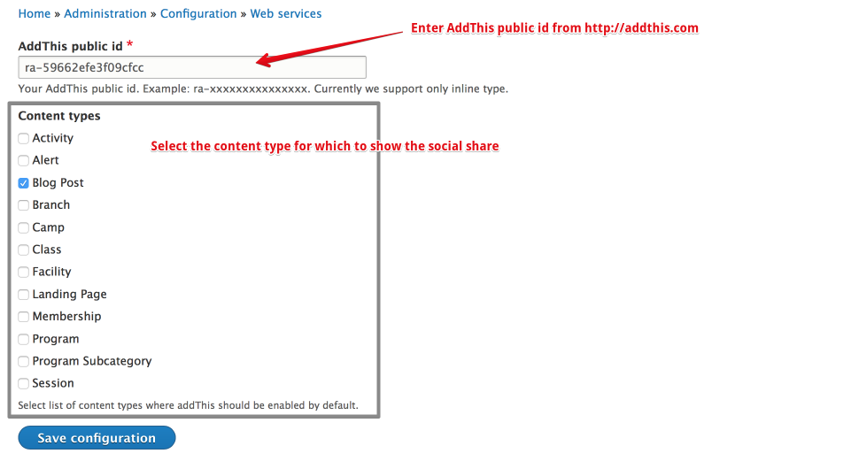

# How to configure AddThis

OpenY AddThis module allow you easy add Social icons to any node.

1. Go to `http://www.addthis.com` and create your account and get public id.

2. Go to `/admin/config/services/openy-addthis` add public id

3. Select the content type for which to show the social icons and save.

