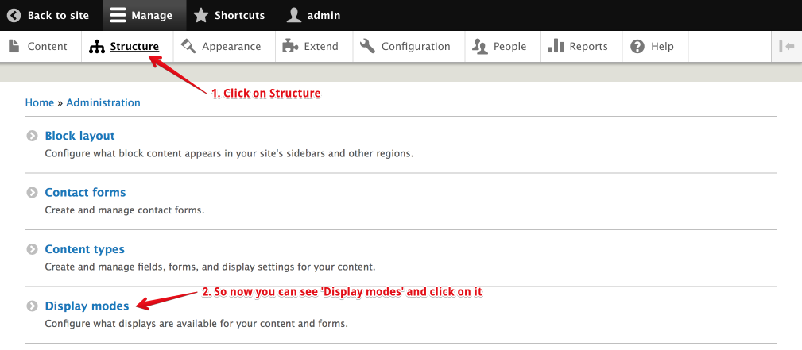
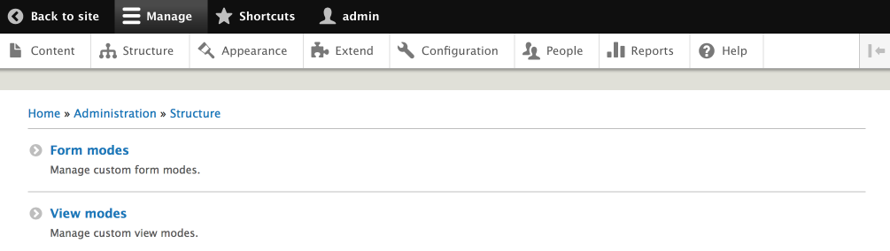
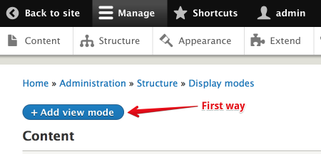
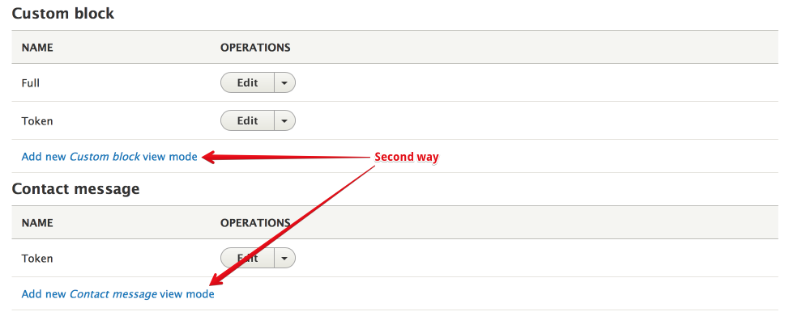
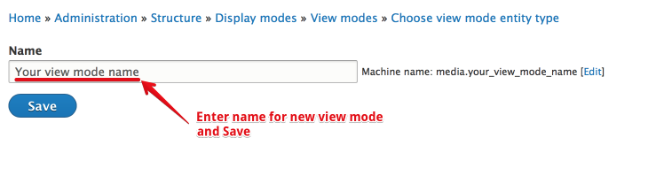
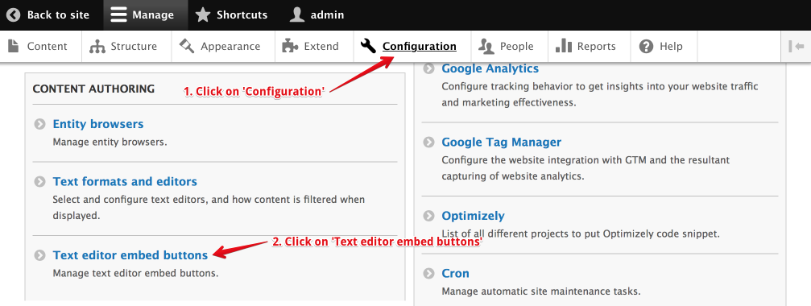
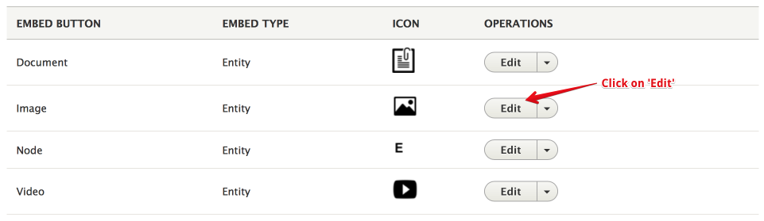
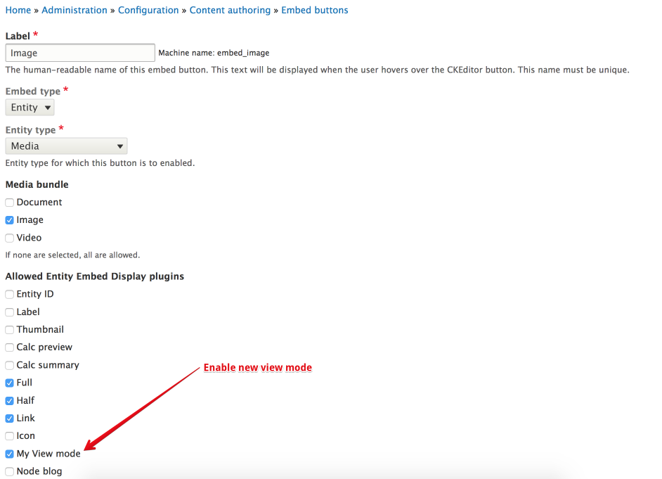

# How to Create new View mode and use
As with any other entity in drupal, when it comes to render the rendering it in different contexts, you might want to have specific viewmodes.

Here you can find instructions how you can add new view modes into embedded entity form on Open Y distribution.

## How-to create new View mode 
1. Go to 'View modes' page: Structure -> Display modes -> View modes (or visit the URL: /admin/structure/display-modes/view )

2. Create new view mode: click 'Add view mode' button and select entity type (or visit the URL: /admin/structure/display-modes/view/add )

or after each entity type you can see 'Add new {Name} view mode' and click on it 

3. Select "Media" and then give a name to your new viewmode (or visit the URL: /admin/structure/display-modes/view/add/media ) 

## How-to use new View mode 
1. Go to Configuration -> Text editor embed buttons (or visit the URL: /admin/config/content/embed )

2. Then make sure you enable the new viewmode in "Allowed Entity Embed Display plugins", and at the bottom of the page click "Save".

