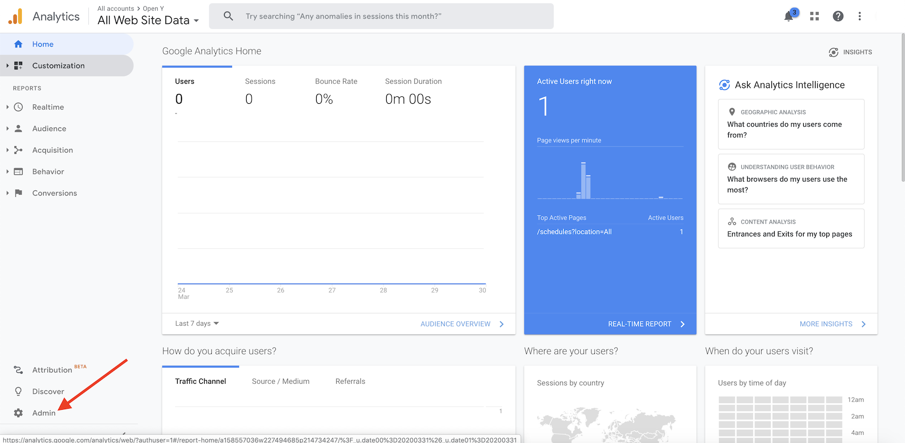
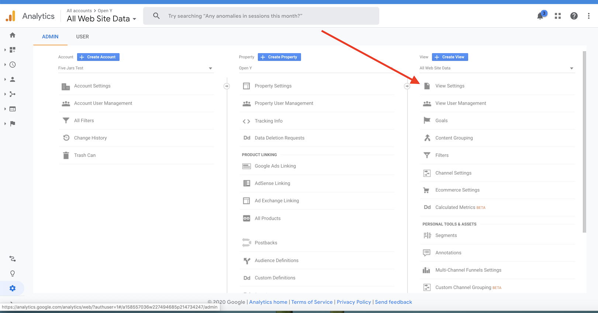
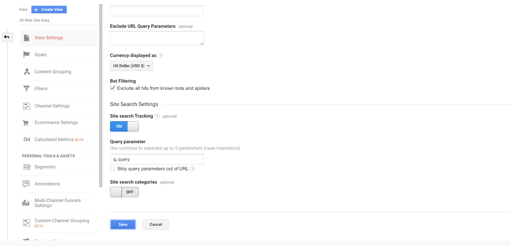

# How to configure search tracking in Google Analytics account
##Prerequisites
Google Analitycs account to track you site should be created.
Google Analitycs contrib module should be enabled and configured to use existing GA account.

##Steps
1. Log in to Google Analytics account that configured to track your Open Y site.

2. Click Admin button in bottom right corner of main screen

3. Click View Settings

4. Scroll to “Site Search Settings” section and enable “Site Search Tracking” switch

5. Fill query parameter field with `q, query` values and click Save

6. Reports about the search tracking you can find at main screen in Behavior → Site Search Section

Attention: Data processing latency for search tracking reports is 24-48 hours
(see https://support.google.com/analytics/answer/1070983?hl=en#DataProcessingLatency)
