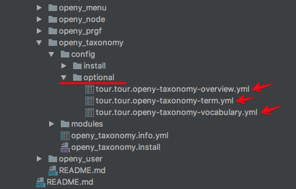
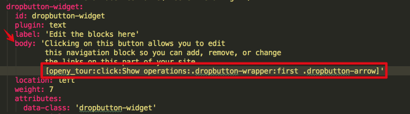

# How to use Tour for modules

### How to use Open Y Tour Token with Tour

In someone modules have tour tips and for more interactivity, you can add a token with a click to any selector.

1. In the module open tour yml file.


2. Select the tip for edit and in body add token like this [openy_tour:click:button_name:selector]


3. Create hook update for you changes and in command line run drush updb -y

#### Token components: 
```
[openy_tour:click:button_name:selector]*
```
openy_tour - token name;

click - command in the token;

button_name - name of button when show in a tip;

selector - selector to be clicked. 

Please see and use [jQuery selectors](https://www.w3schools.com/jquery/jquery_ref_selectors.asp).
